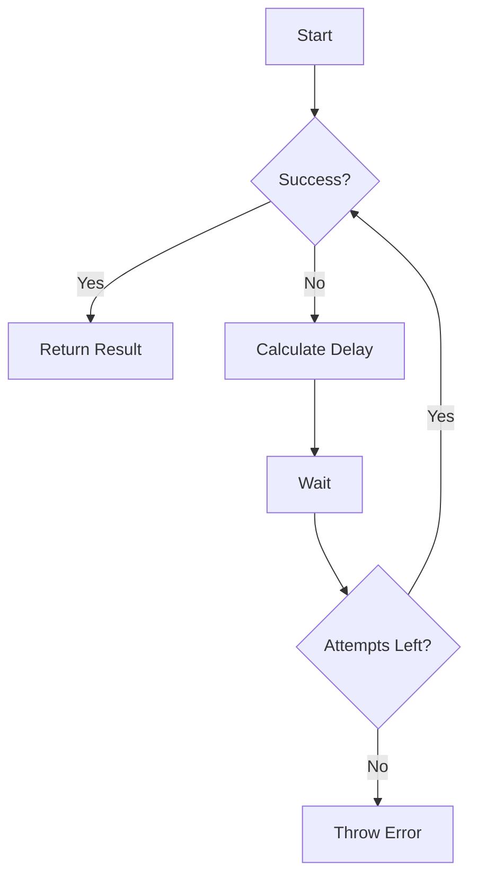
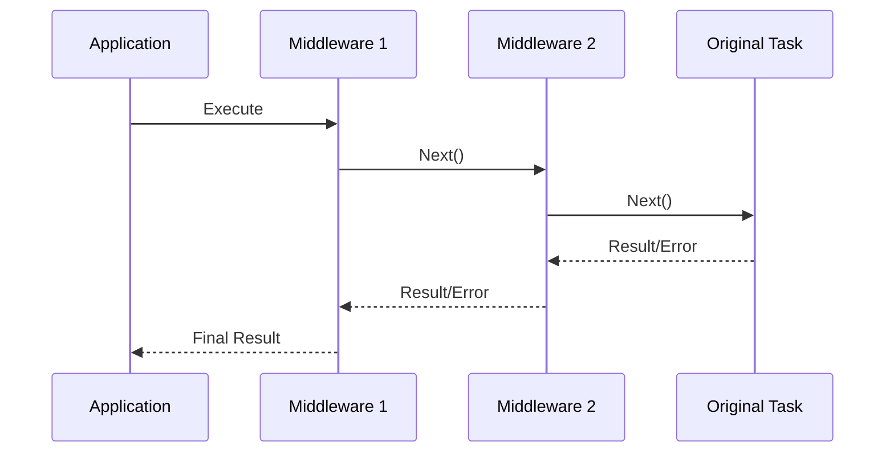
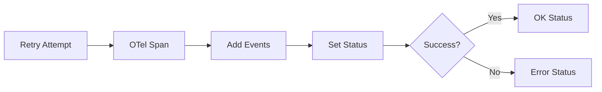

# Super-Retry 🔄

A robust retry library for Node.js with middleware support, policy-driven configurations, and OpenTelemetry integration.


## Features ✨

- **Multiple Strategies**: Fixed, Exponential, Jitter backoffs
- **Declarative Policies**: YAML/JSON configuration support
- **Middleware System**: Add logging, metrics, caching
- **LLM Optimized**: Built-in AI API error handling
- **Observability**: OpenTelemetry spans & events

## Installation 📦

```bash
npm install super-retry
```

## Quick Start 🚀

```typescript
import { Retry } from 'super-retry';

const retry = new Retry({
  strategy: 'exponential',
  maxAttempts: 3,
  initialDelayMs: 1000
});

await retry.execute(async () => {
  await fetch('https://api.example.com');
});
```

## Core Concepts 🧠

### 1. Retry Strategies



| Strategy      | Formula                      | Use Case                |
|---------------|------------------------------|-------------------------|
| Fixed         | `initialDelay`               | Predictable intervals   |
| Exponential   | `initialDelay * 2^(attempt)` | Backend APIs            |
| Jitter        | `exponential * random(0.5-1)`| Distributed systems     |

### 2. Middleware Pipeline



## API Reference 📚

### Retry Class

```typescript
class Retry {
  constructor(options: RetryOptions);
  use(middleware: Middleware): this;
  execute<T>(task: () => Promise<T>): Promise<T>;
}
```

### Policy Configuration

```yaml
# retry-policy.yml
maxAttempts: 5
initialDelayMs: 200
strategy: jitter
conditions:
  - errorType: RateLimitError
  - statusCode: 503
```

## Examples 🧪

### Basic Usage
```typescript
const retry = new Retry({
  strategy: 'jitter',
  maxAttempts: 4,
  initialDelayMs: 500
});

await retry.execute(fetchStockPrices);
```

### With YAML Policy
```typescript
import { loadPolicyFromYAML } from 'super-retry/policy';

const policy = loadPolicyFromYAML(fs.readFileSync('policy.yml'));
const retry = new Retry(policy);
```

### Middleware Chain
```typescript
retry
  .use(loggingMiddleware)
  .use(cacheMiddleware)
  .use(telemetryMiddleware);
```

### LLM Error Handling
```typescript
import { isRetriableLLMError } from 'super-retry/llm';

new Retry({
  retryIf: isRetriableLLMError,
  // ...
});
```

## Advanced Topics 🔭

### Custom Strategies
```typescript
import { registerStrategy } from 'super-retry';

registerStrategy('fibonacci', (attempt, delay) => {
  const fib = [1, 1, 2, 3, 5, 8][attempt];
  return fib * delay;
});
```

### OpenTelemetry Integration


## Benchmarks 📊

| Library       | Throughput (ops/sec) | Memory Usage |
|---------------|----------------------|--------------|
| Super-Retry   | 15,432               | 4.2 MB       |
| Async-Retry   | 12,189               | 3.8 MB       |
| P-Retry       | 10,456               | 3.5 MB       |

## Contributing 🤝

1. Fork the repository
2. Install dependencies: `npm ci`
3. Run tests: `npm test`
4. Commit changes: `git cz`
5. Open a PR!

---
[](https://www.npmjs.com/package/super-retry)
[](https://github.com/khizerarshad/super-retry)
**License**: MIT | **Author**: Khizer Arshad | **Version**: 1.0.0