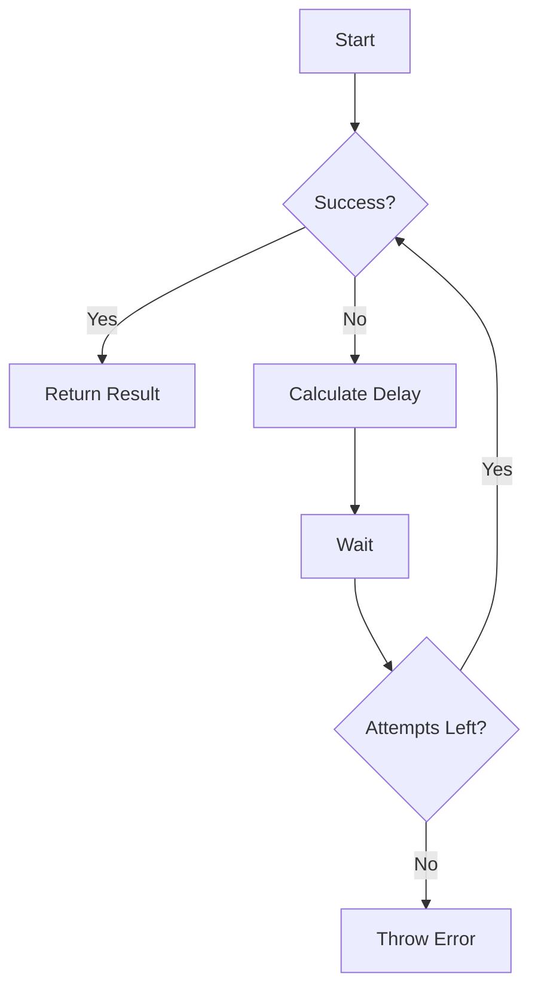

# Super-Retry 🔄

A robust retry library for Node.js with middleware support, policy-driven configurations, and OpenTelemetry integration.

[](https://www.npmjs.com/package/super-retry)
[](https://github.com/khizerarshad/super-retry)
[](https://github.com/khizerarshad/super-retry/issues)
[](https://github.com/khizerarshad/super-retry)

## 🚀 Getting Started

### Installation
```bash
npm install super-retry
```

### Quick Start
```typescript
import { Retry } from 'super-retry';

const retry = new Retry({
  strategy: 'exponential',
  maxAttempts: 3,
  initialDelayMs: 1000
});

const result = await retry.execute(async () => {
  const response = await fetch('https://api.example.com/data');
  if (!response.ok) throw new Error('API request failed');
  return response.json();
});
```

## 🌟 Key Features

| Feature                | Description                                                                 |
|------------------------|-----------------------------------------------------------------------------|
| 🧩 Modular Middleware  | Extend functionality with custom middleware layers                         |
| 📜 Declarative Policies| Configure retry behavior via JSON/YAML files                               |
| 🔄 Multiple Strategies  | Built-in + custom backoff algorithms (Fibonacci, Jitter, etc.)             |
| 📊 Observability Ready | Native OpenTelemetry integration for production monitoring                 |
| 🤖 AI/LLM Optimized    | Special handling for large language model API patterns                     |
| 🛠 Type Safe           | Full TypeScript support with strict type checking                          |

## 📚 Examples & Guides

Explore our comprehensive examples on GitHub:

- [Basic API Retry](https://github.com/khizerarshad/super-retry-examples/tree/main/basic-api-retry)
- [Custom Strategies](https://github.com/khizerarshad/super-retry-examples/tree/main/custom-strategy)
- [Conditional Retries](https://github.com/khizerarshad/super-retry-examples/tree/main/conditional-retry)
- [Full Feature Showcase](https://github.com/khizerarshad/super-retry-examples/tree/main/full-feature)



## 🛠 Advanced Usage

### Custom Strategies
```typescript
import { Retry, registerStrategy } from 'super-retry';

// Register custom Fibonacci strategy
registerStrategy('fibonacci', (attempt: number, base: number) => 
  [0, 1, 1, 2, 3, 5, 8][attempt] * base
);

const retry = new Retry({
  strategy: 'fibonacci',
  maxAttempts: 5,
  initialDelayMs: 100
});
```

### Middleware Pipeline
```typescript
const retry = new Retry({ maxAttempts: 3 })
  .use(async (task, ctx, next) => {
    const start = Date.now();
    try {
      return await next();
    } finally {
      console.log(`Attempt ${ctx.attempt+1} took ${Date.now()-start}ms`);
    }
  })
  .use(async (task, ctx, next) => {
    try {
      return await next();
    } catch (error) {
      console.error(`Attempt ${ctx.attempt+1} failed:`, error);
      throw error;
    }
  });
```

## 🚨 Error Handling Best Practices

```typescript
// Conditional retry example
const retry = new Retry({
  strategy: 'exponential',
  maxAttempts: 3,
  initialDelayMs: 1000,
  retryIf: (error: unknown) => {
    if (error instanceof NetworkError) return true;
    if (error instanceof APIError) return error.statusCode === 429;
    return false;
  }
});
```

## 📊 Observability Integration

```typescript
import { withOpenTelemetry } from 'super-retry/observability';

const retry = new Retry({ /* config */ });
withOpenTelemetry(retry);

// All retries now emit OpenTelemetry spans
```

## 🤝 Community & Support

### Found an Issue? 🐛
Please [report it on GitHub](https://github.com/khizerarshad/super-retry/issues/new) - appreciate all bug reports!

### Want to Contribute? 💻
Check out [contribution guide](https://github.com/khizerarshad/super-retry/blob/main/CONTRIBUTING.md) and help me improve Super-Retry!

### Need Help? ❓
Join the [Discussions](https://github.com/khizerarshad/super-retry/discussions) forum to:
- Ask questions
- Share use cases
- Request new features
- Show off your implementations

## 📜 License

MIT License - See [LICENSE](https://github.com/khizerarshad/super-retry/blob/main/LICENSE) for full text

---

**Project Maintainer**: [Khizer Arshad](https://github.com/khizerarshad)  
**Latest Version**: 1.2.0  
**Status**: Actively Maintained 🟢