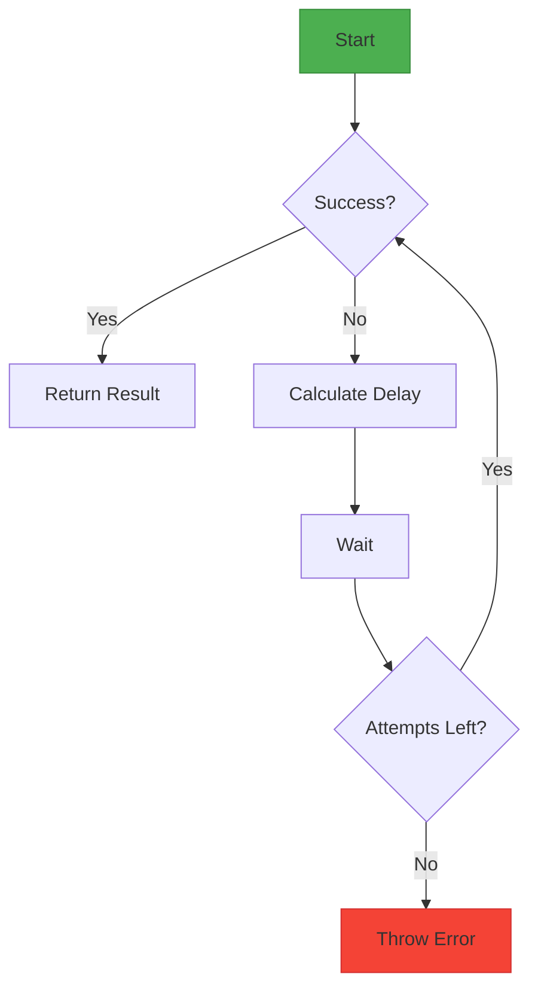
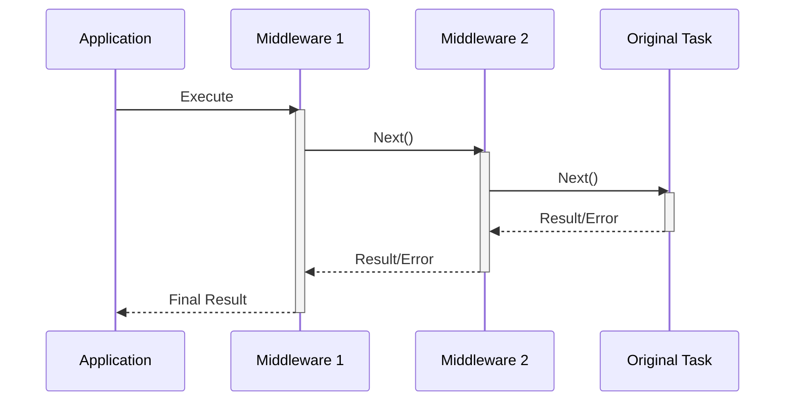
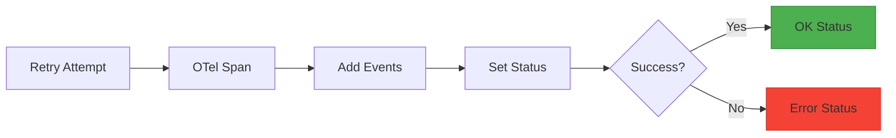

# Super-Retry 🔄

A robust retry library for Node.js with middleware support, policy-driven configurations, and OpenTelemetry integration.

[](https://www.npmjs.com/package/super-retry)
[](https://github.com/khizerarshad/super-retry)

## Why Choose Super-Retry? 🏆

### Key Differentiators
| Feature                | Super-Retry          | Typical Alternatives   |
|------------------------|----------------------|------------------------|
| Configuration          | YAML/JSON Policies   | Code-only              |
| Extensibility          | Middleware Pipeline  | Monolithic             |
| AI/ML Ready            | Built-in LLM Support | Generic                |
| Observability          | OpenTelemetry Native | Manual Instrumentation |
| Strategy System        | Customizable Plugins | Fixed Algorithms       |

**Why It Matters**:
- 🗂 **Declarative Configs**: Modify retry behavior without code changes
- 🧩 **Modular Architecture**: Add features via middleware plugins
- 🔍 **Production Insights**: Built-in distributed tracing
- 🤖 **AI First**: Special handling for LLM API patterns

## Features ✨

- **Multiple Strategies**: Fixed, Exponential, Jitter backoffs
- **Declarative Policies**: YAML/JSON configuration support  
- **Middleware System**: Add logging, metrics, caching  
- **LLM Optimized**: Built-in AI API error handling  
- **Observability**: OpenTelemetry spans & events  

## Installation 📦

```bash
npm install super-retry
```

## Quick Start 🚀

```typescript
import { Retry } from 'super-retry';

const retry = new Retry({
  strategy: 'exponential',
  maxAttempts: 3,
  initialDelayMs: 1000
});

await retry.execute(async () => {
  await fetch('https://api.example.com');
});
```

## Real-World Scenarios 🎯

### 1. E-Commerce Payment Processing
**Challenge**: Handling payment gateway timeouts during peak traffic  
**Solution**:
```typescript
const paymentRetry = new Retry({
  strategy: 'jitter',
  maxAttempts: 3,
  initialDelayMs: 1500,
  retryIf: err => err.code === 'ECONNRESET'
});
```
**Benefits**:  
- Prevents duplicate charges with attempt tracking
- Jitter randomization avoids merchant-side throttling

### 2. IoT Device Communication
**Challenge**: Unstable connections in remote deployments  
**Solution**:
```yaml
# policies/iot-retry.yml
maxAttempts: 7
strategy: exponential
initialDelayMs: 3000
conditions:
  - errorType: 'NetworkError'
```
```typescript
const sensorRetry = new Retry(loadPolicy('iot-retry.yml'));
```
**Benefits**:  
- Exponential backoff preserves battery life
- Central policy management across device fleets

### 3. AI Service Integration
**Challenge**: Handling GPT-4 API rate limits  
**Solution**:
```typescript
import { isRetriableLLMError } from 'super-retry/llm';

const aiRetry = new Retry({
  strategy: 'exponential',
  maxAttempts: 5,
  retryIf: isRetriableLLMError
});
```
**Benefits**:  
- Automatic backoff on 429 errors
- Compliance with AI provider SLAs

## Core Concepts 🧠

### 1. Retry Strategies



| Strategy      | Formula                      | Best For                |
|---------------|------------------------------|-------------------------|
| Fixed         | `initialDelay`               | Cron jobs, batch processing |
| Exponential   | `initialDelay * 2^(attempt)` | External APIs, databases |
| Jitter        | `exponential * random(0.5-1)`| Distributed systems, IoT |

### 2. Middleware Pipeline



## Comprehensive Examples 🧪

### 1. Basic API Retry
```typescript
import { Retry } from 'super-retry';

const retry = new Retry({
  strategy: 'jitter',
  maxAttempts: 3,
  initialDelayMs: 1000
});

async function fetchUserData() {
  const response = await fetch('https://api.example.com/users');
  if (!response.ok) throw new Error('API request failed');
  return response.json();
}

const userData = await retry.execute(fetchUserData);
```

### 2. Policy-Driven Configuration
```yaml
# retry-policy.yml
maxAttempts: 5
initialDelayMs: 2000
strategy: exponential
retryIf:
  - statusCode: 429
  - errorType: 'DatabaseConnectionError'
  - messageContains: 'timeout'
```

```typescript
import { Retry, loadPolicyFromYAML } from 'super-retry';
import fs from 'fs';

const policy = loadPolicyFromYAML(fs.readFileSync('retry-policy.yml', 'utf-8'));
const retry = new Retry(policy);

await retry.execute(databaseTransaction);
```

### 3. Advanced Middleware Chain
```typescript
import { Retry } from 'super-retry';

const retry = new Retry({ maxAttempts: 4 })
  .use(async (task, ctx, next) => {
    console.log(`Attempt ${ctx.attempt + 1} started`);
    const start = Date.now();
    try {
      return await next();
    } finally {
      console.log(`Attempt ${ctx.attempt + 1} took ${Date.now() - start}ms`);
    }
  })
  .use(async (task, ctx, next) => {
    metrics.increment('retry.attempt', { count: ctx.attempt });
    return next();
  });

await retry.execute(processCriticalOrder);
```

### 4. AI Service Integration
```typescript
import { Retry, isRetriableLLMError } from 'super-retry';

const llmRetry = new Retry({
  strategy: 'exponential',
  maxAttempts: 5,
  initialDelayMs: 2000,
  retryIf: isRetriableLLMError
});

async function queryAIService(prompt: string) {
  const response = await fetch('https://api.ai-service.com/v1/chat', {
    method: 'POST',
    body: JSON.stringify({ prompt })
  });
  
  if (response.status === 429) throw { code: 'rate_limited' };
  return response.json();
}

const aiResponse = await llmRetry.execute(() => 
  queryAIService('Explain quantum computing')
);
```

### 5. Custom Backoff Strategy
```typescript
import { Retry, registerStrategy } from 'super-retry';

registerStrategy('fibonacci', (attempt, baseDelay) => {
  const sequence = [1, 1, 2, 3, 5, 8];
  return sequence[Math.min(attempt, sequence.length - 1)] * baseDelay;
});

const retry = new Retry({
  strategy: 'fibonacci',
  maxAttempts: 6,
  initialDelayMs: 150
});

await retry.execute(uploadLargeFile);
```

### 6. Observability Integration
```typescript
import { Retry, withOpenTelemetry } from 'super-retry';
import { trace } from '@opentelemetry/api';

const retry = new Retry({
  maxAttempts: 3,
  strategy: 'fixed',
  initialDelayMs: 500
});

withOpenTelemetry(retry);

async function paymentProcessing() {
  const span = trace.getTracer('payments').startSpan('process-payment');
  // Payment logic here
  span.end();
}

await retry.execute(paymentProcessing);
```

## API Reference 📚

### Retry Class
```typescript
class Retry {
  constructor(options: RetryOptions);
  use(middleware: Middleware): this;
  execute<T>(task: () => Promise<T>): Promise<T>;
}
```

### Policy Configuration
```typescript
interface RetryOptions {
  maxAttempts: number;
  initialDelayMs: number;
  strategy: BackoffStrategy;
  retryIf?: (error: unknown) => boolean;
}
```

## Advanced Topics 🔭

### Custom Strategies
```typescript
import { registerStrategy } from 'super-retry';

registerStrategy('custom-backoff', (attempt, initialDelay) => {
  return Math.min(initialDelay * (attempt ** 2), 5000);
});
```

### OpenTelemetry Integration


## Contributing 🤝

1. Fork the repository  
2. Install dependencies: `npm ci`  
3. Run tests: `npm test`  
4. Commit changes: `git cz`  
5. Open a PR!  

---

**License**: MIT | **Author**: Khizer Arshad | **Version**: 1.1.0